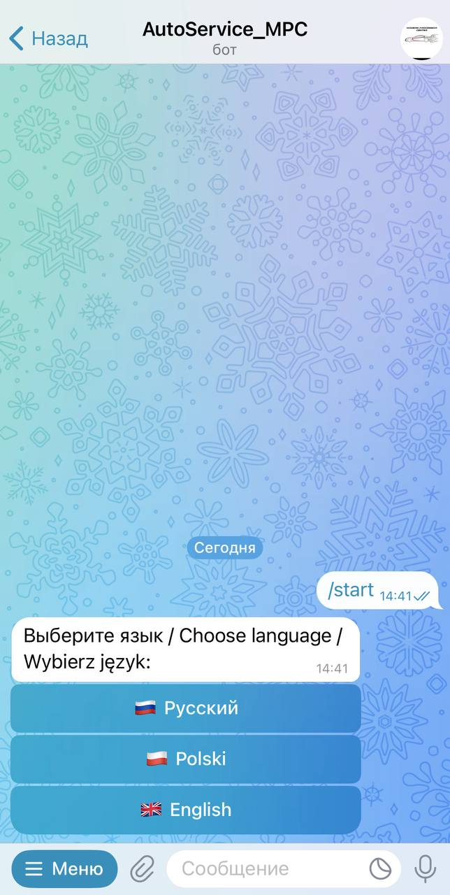
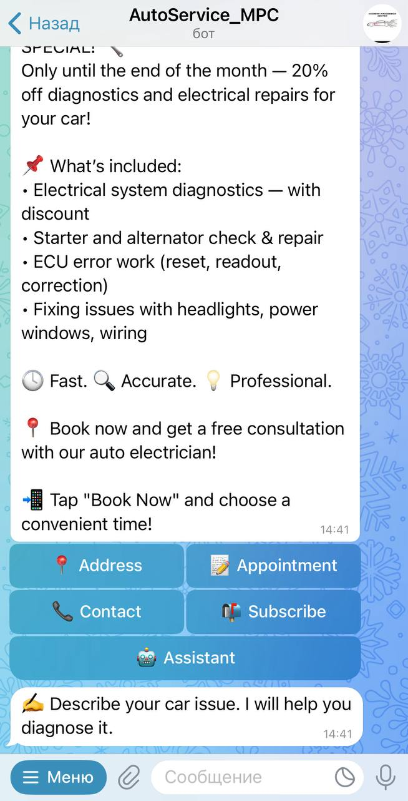

# 🤖 Car Service Bot

A Telegram bot for an auto repair service with integration into **Google Sheets** and **Google Calendar**.  
Allows clients to book appointments, receive announcements, view promotions, and interact with an AI assistant for diagnostics.

---

## 🚀 Features

- 🌐 Multilingual support: Russian and Polish
- 📅 Google Calendar integration — select available time slots
- 📊 Google Sheets CRM integration (requests, history, parts)
- 🧠 AI assistant for error codes and symptoms (ChatGPT)
- 📍 Send location and route buttons
- 📢 Admin-controlled newsletter broadcasts
- 🔔 Telegram notifications for new client requests
- 🐳 Dockerized deployment with monitoring

---

## 📦 Installation

```bash
git clone https://github.com/yaromindzmitry/car-service-bot.git
cd car-service-bot
cp .env.example .env
# Edit .env and credentials.json
docker compose up -d
```

---

## ⚙️ Environment Variables

Create a `.env` file based on the following template:

```env
BOT_TOKEN=your-telegram-bot-token
GOOGLE_SHEET_ID=your-google-sheet-id
CALENDAR_ID=your-calendar-id
ADMIN_CHAT_ID=your-admin-id
LANGUAGES=ru,pl
```

---

## 🧠 AI Assistant

The bot collects:
- Make, model, year, engine capacity, and fuel type
- Symptoms or error codes
- Provides potential causes or requests external data for known codes

---

## 🗂️ Google Sheets CRM Structure

- `Zlecenia` — requests from the bot
- `Клиенты` — client database
- `Прием авто` — intake view
- `История обслуживания` — service history
- `Заказ-наряды` — job orders
- `Запчасти` — parts inventory
- `Финансы` — profit tracking

---

## 🧾 UI Examples

### Multilingual start menu:


### AI diagnostics flow:


---

## 📊 Grafana Monitoring

Bot and infrastructure are monitored with **Prometheus + Grafana**.

### 🧱 Container metrics (cAdvisor)


### 🐳 Docker Monitoring Dashboard


### 🖥️ Node Exporter Full


---

## 🐳 Docker Compose

```yaml
version: '3.8'

services:
  bot:
    build: .
    container_name: car_service_bot
    restart: always
    env_file:
      - .env
    volumes:
      - ./credentials.json:/app/credentials.json
```

---

## 📬 Notifications and Alerts

- Admin receives a message when a new request is submitted
- Telegram alerts via Prometheus when CPU or RAM thresholds are exceeded

---

## 📄 License

Project is licensed under the [MIT License](LICENSE)

---

## 💬 Contact

Author: [Dzmitry Yaromin](https://github.com/yaromindzmitry)  
Telegram: [@MPCBimmerUpdate](https://t.me/MPCBimmerUpdate)

---

## 🛠 Technologies & Skills

### Languages & Frameworks:
- Python (asyncio, `aiogram`)
- JavaScript (for Google Sheets frontend logic, if applicable)

### APIs & Integrations:
- Telegram Bot API (`aiogram`)
- Google Sheets API
- Google Calendar API
- OpenAI API (ChatGPT)

### DevOps & Infrastructure:
- Docker & Docker Compose
- Prometheus + Grafana (monitoring)
- Node Exporter, cAdvisor
- Telegram alerts via Prometheus
- LXD containers (Ubuntu server on NAS)

### Other Skills:
- Multi-language input validation and UX in Telegram
- Secure handling of `.env` and `credentials.json`
- Google automation for CRM and scheduling
- Git + GitHub (project structure and collaboration)
